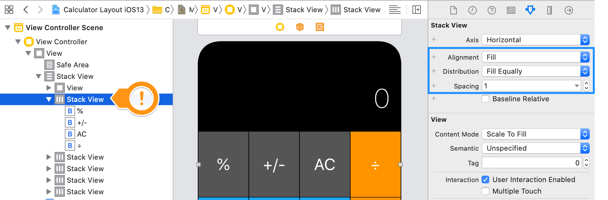
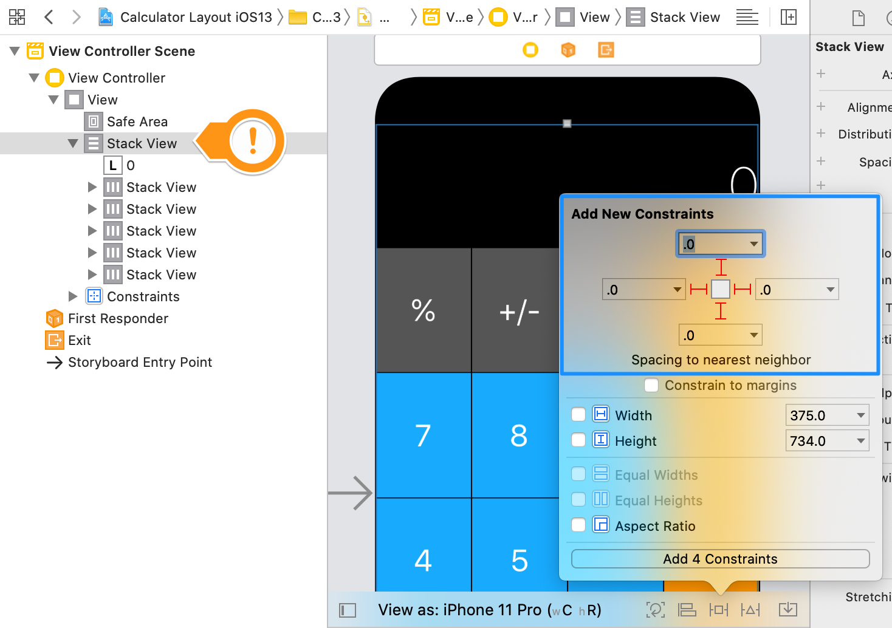
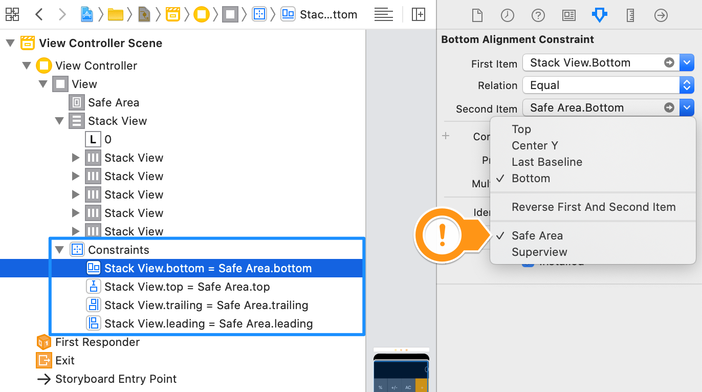
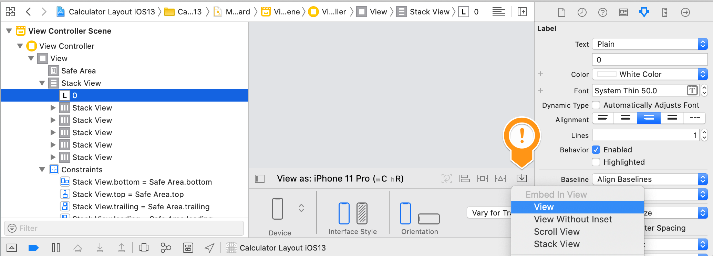
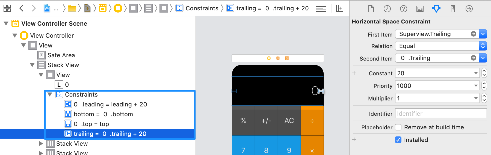
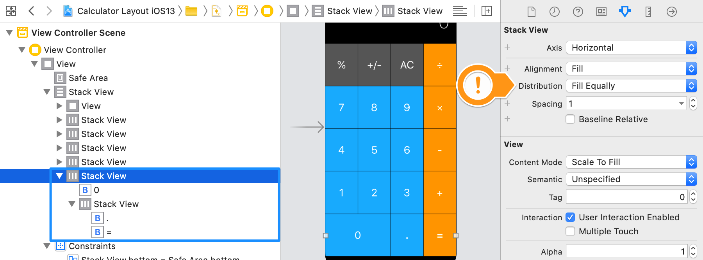

# Calculator Layout Challenge Solution

These are the steps to achieve this layout:

1. Place all the buttons buttons in horizontal stacks to represent the rows (5 in total) - Stack Properties: Alignment: Fill, Distribution: Fill Equally, Spacing: 1

2. Place the Label and all 5 Horizontal Stacks from step 1 into a single Vertical Stack - Stack Properties: Alignment: Fill, Distribution: Fill Equally, Spacing: 1

3. Vertical Stack Pinned to all four edges of superview

Bronze Medal: Change the constraints set in step 3 to be relative to the Safe Area instead of superview.

Silver Modal: If you want the label to have padding on the left and right, you'll need to embed it in a View and then set 2 pin constraints from the label to the view of 20px each side and 2 pic constraints from the top and bottom of 0px.

Gold Medal: If you want the 0 button to take up as much space as the . and =, you'll need to embed the . and = in their own horizontal stack, then embed the 0 and that horizontal stack in a new horizontal stac. This will make the 0 button take up the same space as the other two buttons. Both Horizontal Stacks need to have Distribution set to "Fill Equally".

>This is a companion project to The App Brewery's Complete App Development Bootcamp, check out the full course at [www.appbrewery.co](https://www.appbrewery.co/)

